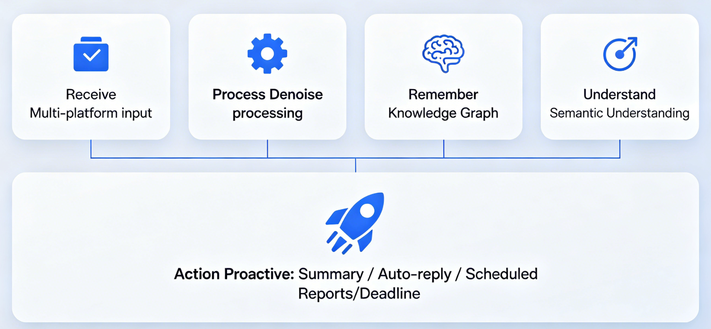

<div align="center">
<picture>
  <source media="(prefers-color-scheme: dark)" srcset="apps/web/public/images/logo-dark-light.svg">
  
</picture>

</br>
</br>

[](https://nodejs.org) [](https://tauri.app) [](https://alloomi.ai) [](https://www.apache.org/licenses/LICENSE-2.0) [](https://discord.com/invite/xkJaJyWcsv) [](https://x.com/AlloomiAI)

#### _Proactive AI workspace — understands your intent, orchestrates execution, and gets things done._

  <a href="https://github.com/melandlabs/release">
    
  </a>
</div>

Alloomi is a **proactive AI workspace** that monitors business signals, orchestrates tasks autonomously, and tracks and validates results end-to-end. Unlike traditional AI assistants that are passive workflow tools, Alloomi acts as a **proactive AI workspace** that watches, learns, remembers, and acts on your behalf.

## What Problems Does Alloomi Solve?

| The Problem                                                                                                                                                              | Why It Happens                                                                               | How Alloomi Fixes It                                                                                                                                                                     | The Benefit                                                           |
| ------------------------------------------------------------------------------------------------------------------------------------------------------------------------ | -------------------------------------------------------------------------------------------- | ---------------------------------------------------------------------------------------------------------------------------------------------------------------------------------------- | --------------------------------------------------------------------- |
| **Context Loss** — AI forgets everything between sessions, forcing you to re-explain background, preferences, and style every time                                       | Most agents live in chat windows with no persistent memory across tools and files            | **Persistent memory that gets smarter the more you use it** — your AI learns your habits, remembers decisions, and carries context across months                                         | Never re-explain context again; AI remembers everything across months |
| **Prompt Fatigue** — The "Prompt Era" demands you externalize every preference into words, manually maintaining "project briefs" and pasting them into every new session | Without internal memory, the burden of context-setting falls entirely on the user            | **Internalized preferences** — Alloomi's memory engine observes your editing patterns, decisions, and work style to build a persistent model of you, eliminating repetitive explanations | Stop writing repetitive prompts; AI learns your style automatically   |
| **Tool Fragmentation** — AI tools scattered across tabs (ChatGPT, Claude, Notion, Slack) require constant copy-pasting between platforms                                 | One-stop workspaces often just mash tools together without true integration                  | **Truly unified workspace** — Alloomi orchestrates across messaging, email, calendar, and documents in one place with shared context, not just tabs                                      | One workspace, all tools, shared context                              |
| **Trust Gap** — AI agents take high-stakes actions without visibility, leaving users uncomfortable with autonomous execution                                             | Automation without feedback mechanisms creates anxiety around critical tasks                 | **Human-in-the-loop controls** — configurable approval gates for high-risk actions; Alloomi alerts you proactively before issues escalate so you're always in control                    | Stay in control; AI acts autonomously but you approve risky actions   |
| **Platform Overload** — Testing and switching between dozens of AI agent platforms (n8n, Gumloop, Lindy, Manus...) creates decision fatigue                              | The AI agent market is fragmented with no clear winner; each tool has its own learning curve | **All-in-one solution** — skip the endless evaluation cycle. Alloomi combines monitoring, orchestration, memory, and execution in a single desktop app without subscription lock-in      | Skip the evaluation cycle; everything you need in one app             |

## Daily Friction We're Eliminating

| Without Alloomi                                       | With Alloomi                                       |
| ----------------------------------------------------- | -------------------------------------------------- |
| Switching between WeChat, Telegram, WhatsApp to reply | **One interface, reply to all**                    |
| Manually check Slack, Email, Calendar for updates     | **AI proactively alerts you**                      |
| Repetitive tasks done manually every day              | **Set scheduled tasks, AI executes automatically** |
| Forget context after months                           | **Long-term memory that remembers everything**     |

## Quick Start

### Run from Source

```bash
# 1. Clone the repo
git clone https://github.com/melandlabs/alloomi
cd alloomi

# 2. Copy environment config
cp apps/web/.env.example apps/web/.env

# 3. Generate keys
openssl rand -base64 32  # AUTH_SECRET
node -e "console.log(require('crypto').randomBytes(32).toString('base64url'))"  # ENCRYPTION_KEY

# 4. Configure AI API
ANTHROPIC_BASE_URL=https://api.anthropic.com
ANTHROPIC_API_KEY=sk-ant-...
ANTHROPIC_MODEL=claude-sonnet-4-6

LLM_BASE_URL=https://api.openai.com/v1
LLM_API_KEY=sk-...
LLM_MODEL=gpt-4o

# 5. Start
pnpm install
pnpm tauri:dev
```

## Screenshots

<table align="center">
<tr>
<td></td>
<td></td>
</tr>
<tr>
<td colspan="2" align="center">Document Previews (Docx, Excel)</td>
</tr>
<tr>
<td></td>
<td></td>
</tr>
<tr>
<td align="center">Website Generation</td>
<td align="center">Multiple Connectors</td>
</tr>
<tr>
<td></td>
<td></td>
</tr>
<tr>
<td align="center">Automation & Cron Jobs</td>
<td align="center">Library Gallery</td>
</tr>
</table>

> More demos and show cases can be found [here](https://github.com/melandlabs/alloomi/wiki/Use-Case:-Engineering-Daily-Sync)

## Features

### Proactive Awareness

- **📡 Signal Monitoring** — monitors signals across Slack, Email, Calendar, Documents and alerts you proactively before issues escalate
- **🧠 Long-Term Memory** — persistent knowledge graphs of people, projects, and decisions; remembers context even months later
- **🎯 95% Noise Filtering** — hundreds of daily messages refined into one focused panel; tells you what you should act on
- **⚡ Autonomous Execution** — drafts replies, schedules meetings, generates reports, tracks and validates results end-to-end; supports **scheduled tasks** (cron-like recurring jobs) and **proactively triggered tasks** (event-driven actions based on signals from Slack, Email, Calendar, etc.)

### Instant Preview

- **Documents** — Docx, DOC, ODT, RTF
- **Spreadsheets** — Xlsx, XLS, CSV, ODS
- **Presentations** — PPTx, PPT, ODP
- **PDF** — PDF files with full rendering
- **Images** — JPG, PNG, GIF, SVG, WebP, BMP
- **Code** — Syntax-highlighted preview for JS, TS, Python, Go, Rust, and 20+ languages and HTML preview with live rendering

### Multi-Platform Access

- **Messaging Apps** — Telegram, WhatsApp, iMessage, QQ, Feishu, Weixin, Dingtalk integrations with message fetching, sending, file attachments, and real-time sync
- **Desktop Apps** — Native apps for Windows, macOS, and Linux with keyboard shortcuts and system tray

### Enterprise-Grade Security

- AES-256 end-to-end encryption
- Hardware-isolated processing environments (no public gateways)
- Zero training commitments — your data never trains public AI models
- Local-first architecture

## Technical Architecture



> 📖 [Learn more about architecture here](https://github.com/melandlabs/alloomi/wiki/1.What-is-Alloomi)

## Documentation

Detailed documentation is available at [here](https://github.com/melandlabs/alloomi/wiki).

## Community

[](https://discord.com/invite/xkJaJyWcsv) [](https://x.com/AlloomiAI) [](mailto:developer@alloomi.ai)

## License

Apache License 2.0 — see [LICENSE](./LICENSE)
