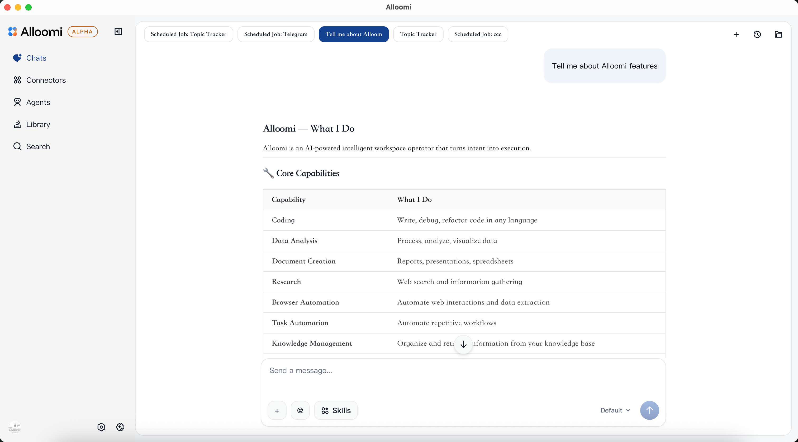
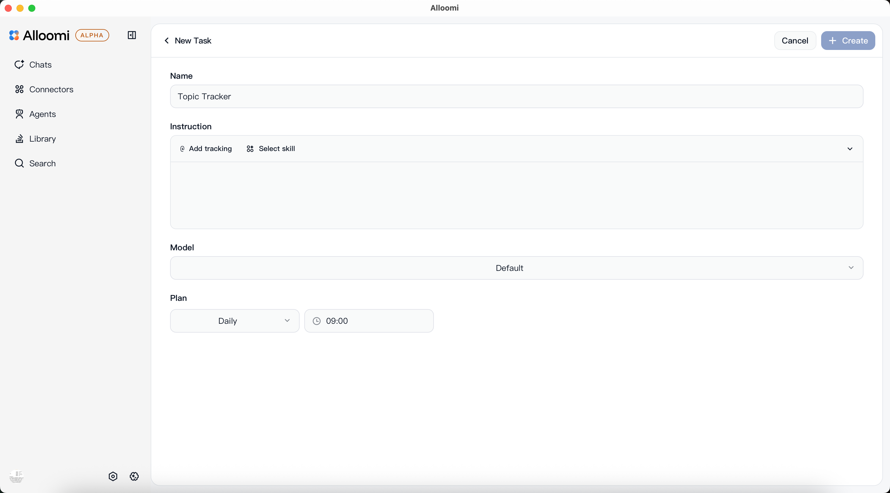
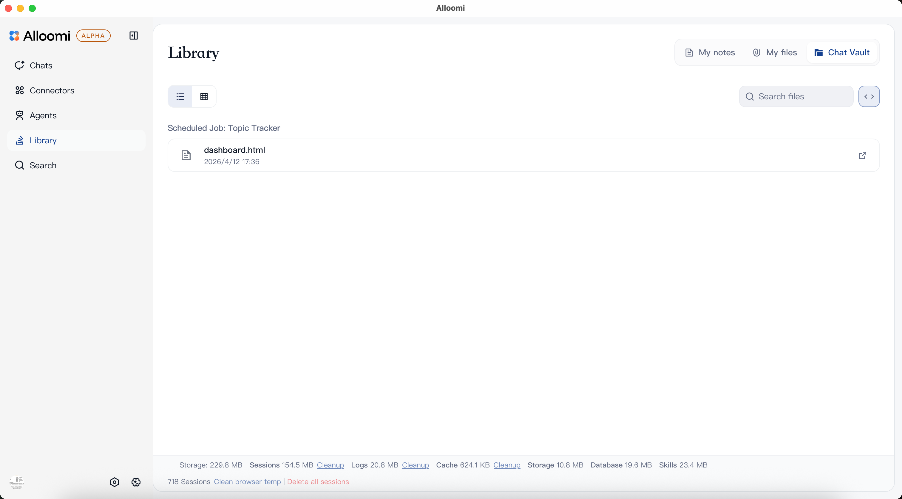
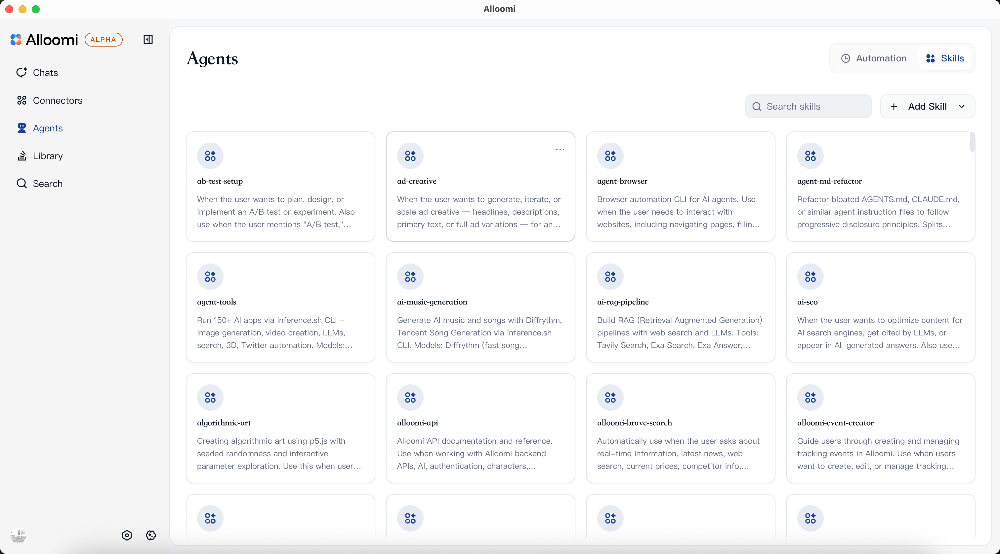

# Alloomi

**Proactive AI workspace** — understands your intent, orchestrates execution, and gets things done.

Alloomi monitors business signals, orchestrates tasks autonomously, and tracks/validates results end-to-end.

## Features

- **📡 Proactive Awareness** — monitors Slack, Email, Calendar, Documents and alerts you before issues escalate
- **🧠 Long-Term Memory** — persistent knowledge graphs of people, projects, and decisions
- **🎯 95% Noise Filtering** — hundreds of daily messages refined into focused action items
- **⚡ Autonomous Execution** — drafts replies, schedules meetings, generates reports end-to-end
- **💬 Natural Chat** — assign tasks in plain language
- **📱 Messaging Apps** — Telegram, WhatsApp, iMessage, QQ, Feishu integrations
- **🔒 Enterprise Security** — SOC 2 compliant, end-to-end encryption, SSO/SAML support

## Screenshots

- Chat



- Connector


- Automation



- Library



- Skill



- Message Apps


See [alloomi.ai](https://alloomi.ai) for more information.

## Developing

Requirements: Node.js 18+, pnpm 9+, Rust Cargo 1.88+

```bash
# Install dependencies
pnpm install --ignore-scripts=false

# Setup database (only once or when schema changes)
cd apps/web && pnpm db:generate && pnpm db:migrate && pnpm db:push && cd ../..

# Start desktop app (requires Rust)
pnpm tauri:dev

# Start web app
pnpm dev
```

Web app runs at [localhost:3415](http://localhost:3415).

## Build & Test

```bash
pnpm tsc          # Type check
pnpm format       # Format code
pnpm lint         # Lint
pnpm lint:fix     # Fix lint issues
pnpm test         # Run tests
```

## Note

This is the **open-source core** of Alloomi. It includes the core infrastructure and modules, but requires you to configure your own LLM API Key, authentication, authorization, AI MCPs and skills. For the full ready-to-use product with all features enabled, please download from the official website: **[alloomi.ai](https://alloomi.ai)**
